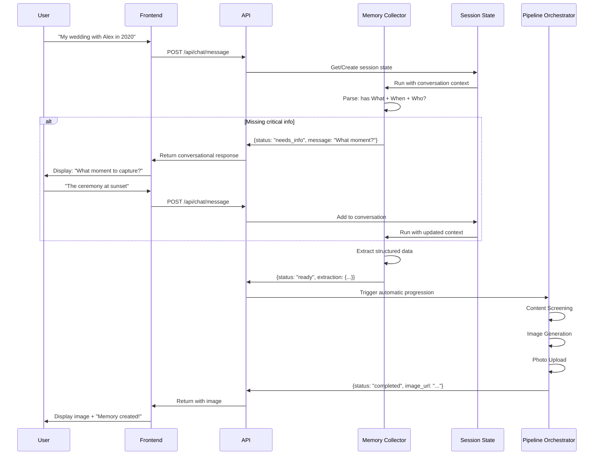
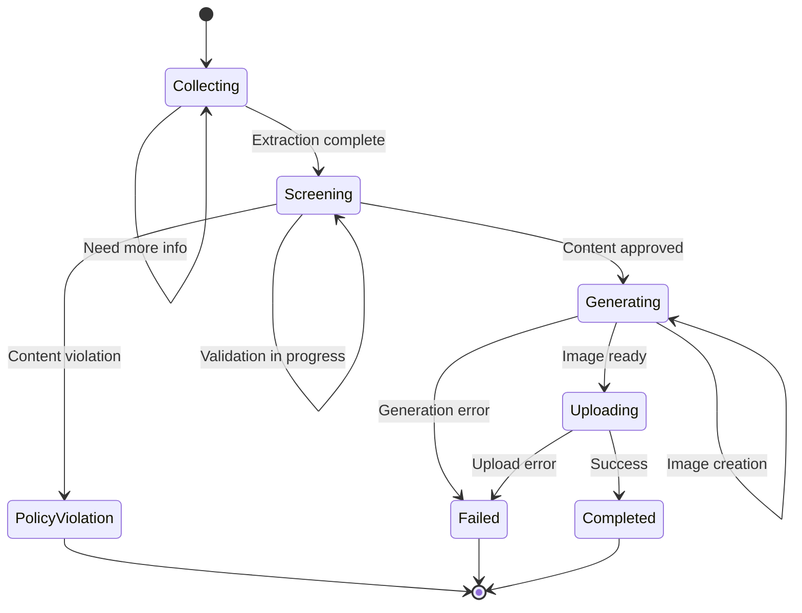
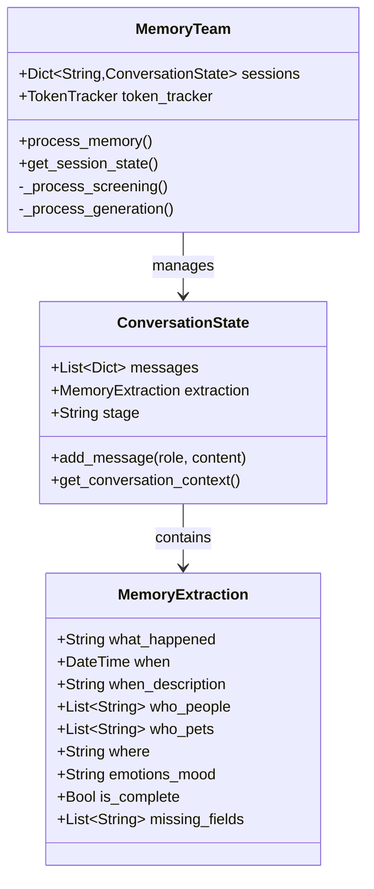
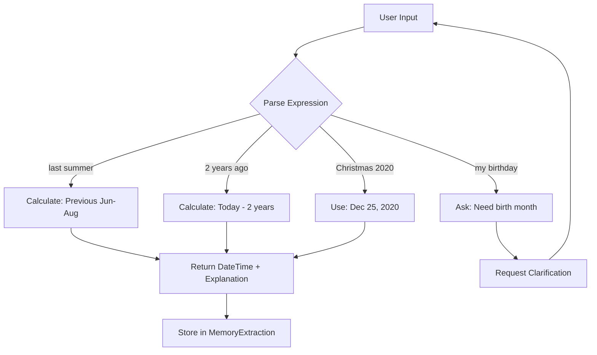
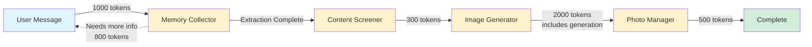

# Memory Collection Flow Diagram

## Quick Conversational Flow (New)



## State Management



## Conversation State



## Date Calculation Examples



## Token Flow



## Comparison: Old vs New

### Old Flow (4-6 exchanges)
```
User: "My wedding"
→ Agent: "When? Where? Who? Describe?"
User: "June 2020 in Napa with Alex"
→ Agent: "What moment?"
User: "The ceremony"
→ Agent: "What time of day?"
User: "Sunset"
→ Agent: "Any other details?"
User: "No"
→ Generate image

Total: 6 exchanges, ~8,000 tokens
```

### New Flow (2-3 exchanges)
```
User: "My wedding with Alex in June 2020"
→ Agent: "What moment would you like to capture?"
User: "The ceremony at sunset"
→ Auto-generate image

Total: 2 exchanges, ~3,500 tokens
```

**Improvement**: 
- 67% fewer exchanges
- 56% fewer tokens
- 50% faster completion
